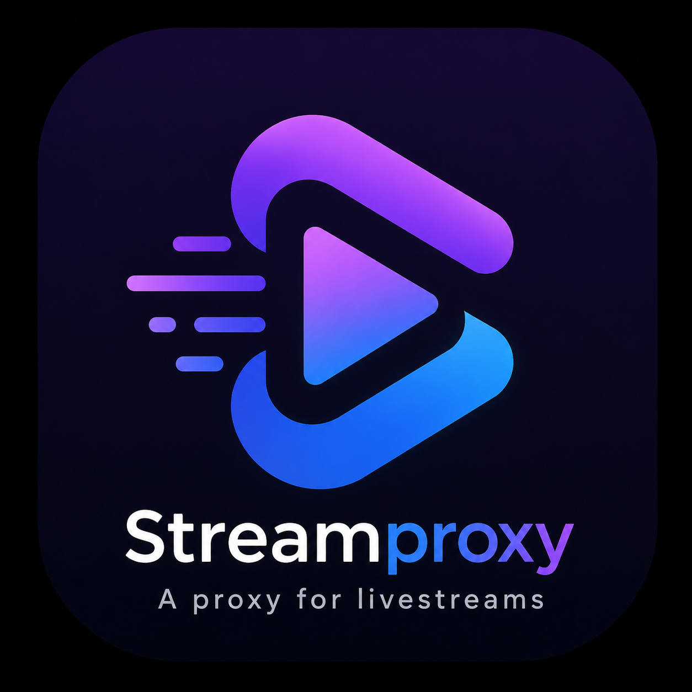

<p align="center">
  
</p>

<p align="center">
  
  
  
  
  
</p>

---

## ✨ What Streamproxy does

With Streamproxy you can watch livestreams from YouTube, Twitch (and any other source supported by Streamlink) in IPTV apps like:

- SSIPTV
- tvheadend
- ProgTV
- and others

Current release: **2.0.4**

To start the server, run from command prompt:

```bash
streamproxy
```

---

## 🧩 Google Chrome extension (StreamProxy Quick Add)

This repository includes a Chrome extension in `chrome-extension-streamproxy` that helps you add the current tab URL as a StreamServer in StreamProxy.

### Install in Google Chrome (recommended)

1. Open `chrome://extensions`.
2. Enable **Developer mode** (top right).
3. Click **Load unpacked**.
4. Select the `chrome-extension-streamproxy` folder from this repository.
5. Pin the extension and open its options page.
6. Configure StreamProxy URL (example: `http://127.0.0.1:4211`) and, if needed, Basic Auth credentials.

### Optional: install from packaged file

- A packaged file may be available as `chrome-extension-streamproxy.crx`.
- Depending on your Chrome policy/version, direct CRX install can be blocked.
- If blocked, use the **Load unpacked** method above.

### Basic usage

1. Open a stream page in Chrome.
2. Click the extension icon.
3. Review the fields and click **Add streamserver**.

> If StreamProxy Basic Auth is enabled, use an account with permission for `POST /api/streamserver`.

---

## 🌐 Streaming endpoints

In your favorite IPTV app, use one of the following URL patterns.

### 1) Streamlink passthrough (video/audio codec passthrough)

`http://<serverip>:<port>/videostream/streamlink?url=<livestreamurl>`

- Livestream will be routed from a live stream URL to any URL compatible with Streamlink.
- Video and audio codecs are passthroughed.

Query parameters:

- `url` => the URL of livestream
- `streamserver` => create a streamserver (`&streamserver=<name>`)
  - You can use `http://<serverip>:<port>/streamserver/create` to create using wizard

Example:

`http://localhost:3000//videostream/streamlink?url=https://www.youtube.com/c/SkyNews/live`

To display the Sky News live stream on your IPTV app.

---

### 2) FFmpeg transcoding to MPEG-2 TS (or configurable format)

`http://<serverip>:<port>/videostream/ffmpeg?url=<livestreamurl>`

- The livestream will be routed and transcoded to MPEG-2 TS format from a live stream URL supported by ffmpeg.

Query parameters:

- `url` => the URL of livestream
- `streamserver` (optional) => create a streamserver (`&streamserver=<name>`)
  - You can use `http://<serverip>:<port>/streamserver/create` to create using wizard
- `videoformat` (optional) => output livestream format
  - if omitted: use config
  - if not in config: default `mpegts`
- `videocodec` (optional) => output video codec
  - if omitted: use config
  - if not in config: default `mpeg2`
- `framesize` (optional) => output frame size
  - if omitted: use input stream frame size
- `framerate` (optional) => output frame rate
  - if omitted: use input stream frame rate
- `serviceprovider` (optional) => output service provider
  - if omitted: use config
  - if not in config: default `streamproxy`
- `streamdescription` (optional) => stream description (service name)
  - if omitted: default `streamproxyservice`

Example:

`http://localhost:3000/videostream/ffmpeg?url=https://rbmn-live.akamaized.net/hls/live/590964/BoRB-AT/master.m3u8`

To display Red Bull TV in MPEG2 TS format on your IPTV app.

---

### 3) Convert video livestream to audio livestream (MP3)

`http://<serverip>:<port>/audiostream/play?url=<livestreamurl>`

- Convert video livestream to audio livestream (`mp3` format).
- You can listen to YouTube channels as radio-like streams.

Query parameters:

- `url` => the URL of livestream
- `streamserver` (optional) => create a streamserver (`&streamserver=<name>`)
  - You can use `http://<serverip>:<port>/streamserver/create` to create using wizard
- `runner` (optional) => what runner will be used: `streamlink` or `ffmpeg`
  - if omitted, streamproxy chooses the best runner
- `title` (optional) => title of audio livestream
  - if omitted, default is `streamproxy audio`

Example:

`http://localhost:3000/videostream/info?url=https://rbmn-live.akamaized.net/hls/live/590964/BoRB-AT/master.m3u8`

Converts Red Bull TV to a streaming radio station.

**NOTE:** On Windows, converting videostream to audiostream is only possible using `ffmpeg` (not streamlink).

---

### 4) YouTube channel to podcast

`http://<serverip>:<port>/youtubetopodcast/<channelid>?apikey=<youtubeapikey>`

- Convert a YouTube channel into a podcast.

Parameters:

- `<channelid>` => YouTube channel id to convert to podcast
- `<youtubeapikey>` => you need a YouTube API key
  - In addition to query string, key can be set with:
    - Environment variable `YOUTUBE_API_KEY` (useful in Docker)
    - `streamproxy.config.json` tag `youtubeapikey`

Notes:

- **OBS1:** This endpoint is alpha and has known issues:
  - episode total length may not be shown
  - server can crash if fast-forward/rewind is used
- **OBS2:** This endpoint is only available when streamproxy is installed on Linux.

---

### 5) Streamlink stream converted to MPEG-2 TS

`http://<serverip>:<port>/videostream/play?url=<livestreamurl>`

- Convert a streamlink stream to MPEG-2 TS.

Query parameters:

- `url` => the URL of livestream
- `streamserver` (optional) => create a streamserver (`&streamserver=<name>`)
  - You can use `http://<serverip>:<port>/streamserver/create` to create using wizard
- `videoformat` (optional) => output livestream format
  - if omitted: use config
  - if not in config: default `mpegts`
- `videocodec` (optional) => output video codec
  - if omitted: use config
  - if not in config: default `mpeg2`
- `framesize` (optional) => output frame size
  - if omitted: input stream frame size
- `framerate` (optional) => output frame rate
  - if omitted: input stream frame rate
- `serviceprovider` (optional) => output service provider
  - if omitted: use config
  - if not in config: default `streamproxy`
- `streamdescription` (optional) => stream description (service name)
  - if omitted: default `streamproxyservice`

Example:

`http://localhost:3000//videostream/streamlink?url=https://www.youtube.com/c/SkyNews/live`

To display Sky News stream in MPEG-2 TS format.

**Note:** due to compatibility issues, this endpoint cannot run if server is installed on Windows.

---

### 6) Snapshot endpoint

`http://<serverip>:<port>/snapshot.jpg?url=<livestreamurl>`

- Capture a snapshot of stream to jpeg image.

Query parameters:

- `url` => livestream URL
- `resolution` => image resolution
  - if omitted: original stream resolution

Example:

`http://localhost:3000/snapshot.jpg?url=?url=https://www.youtube.com/c/SkyNews/live`

Returns a jpeg snapshot of Sky News stream.

---

### 7) Streamserver creation (legacy direct URL)

`http://<serverip>:<port>/streamserver/create`

- A streamserver allows one thread/process to feed several clients using same streamproxy port.
- Access playback URL as: `http://<serverip>:<port>/play/<servername>`
- To close a streamserver session, kill corresponding process in `/status`.
- Compatible with streamlink, ffmpeg and videostream-to-audiostream conversion.

**Important:** prefer `http://<serverip>:<port>/streamserver/list` because it already includes create option.

- Direct access to `/streamserver/create` and `/streamserver/edit` will be removed in a future release.

---

### 8) Streamserver management

`http://<serverip>:<port>/streamserver/list`

- Manage created streamservers.
- You can list, stop, start, edit, delete and create new streamservers.

---

### 9) Download streamserver playlist (M3U)

`http://<serverip>:<port>/streamserver/playlist.m3u`

- Download all mounted streamservers in M3U playlist format.

---

### 10) Restream to another destination

`http://<serverip>:<port>/videostream/restream?url=<livestream>&output=<outputaddress>&format=<format>&vcode=<videocoded>&acodec=<audiocodec>`

- Restream a livestream to another address (for example RTMP).

URL parameters:

- `<livestream>`: source livestream URL
  - on Linux can be streamlink or ffmpeg-compatible
  - on Windows only ffmpeg-compatible streams are accepted
- `<outputaddress>`: destination livestream address
  - example: YouTube RTMP, nginx RTMP, HTTP livestream server, etc.
- `<format>`: livestream format (`mpeg2-ts`, `hls`, `mp3`, etc.)
- `<videocodec>`: video codec (`mp4`, `mpeg2`, `h264`, etc.)
  - optional, if omitted it is copied from source
- `<audiocodec>`: audio codec (`mp3`, `aac`, etc.)
  - optional, if omitted it is copied from source

Notes:

- **This endpoint is in beta and may be removed in future versions**
- Example:
  - `http://localhost:3000/videostream/restream?url=https://www.youtube.com/c/SkyNews/live&output=rtmp://localhost:4113/live&format=mpeg2ts&vcode=mpeg2&acodec=mp3`
  - Restreams Sky News YouTube channel to `rtmp://localhost:4113/live`
- This endpoint must be called from browser
- To kill session, kill corresponding process in `/status`

---

## 👤 User/admin/status endpoints

- `http://<serverip>:<port>/user/list`
  - user list and management (create, edit, delete)
- `http://<serverip>:<port>/user/create`
  - create a new user
- `http://<serverip>:<port>/changepassword`
  - change your own password
  - **OBS:** currently you can only change your own password.
    - If you forgot password, go to users file, remove your user, assign administrator role to `anonymous`, access `/user/list`, recreate your user.
- `http://<serverip>:<port>/status`
  - see status of opened process
- `http://<serverip>:<port>/login`
  - login (if `basicAuthentication` is present in config)
- `http://<serverip>:<port>/logout`
  - logout (if `basicAuthentication` is present in config)
- `http://<serverip>:<port>/log`
  - display log (see parameter `logWeb` in config)
- `http://<serverip>:<port>/stopserver`
  - shutdown streamproxy server

---

## 📚 API documentation

To see list of available APIs:

- `http://<serverip>:<port>/docs/api`
- <https://asabino.stoplight.io/docs/streamproxy/34dd32710e316-streamproxy>

---

## ⚙️ streamproxy.config.json

You can modify program parameters in `streamproxy.config.json` (same folder as executable).

```json
{
  "port": "3000",
  "logconsole": true,
  "logWeb": false,
  "streamlinkpath": "",
  "ffmpegpath": "",
  "youtubeapikey": "",
  "ffmpeg": {
    "codec": "mpeg2video",
    "format": "mpegts",
    "serviceprovider": "streamproxy"
  },
  "streamserver": {
    "startOnInvoke": false,
    "hideStoppedStreamServerInPlaylist": true,
    "stopOnNoConnection": true
  },
  "basicAuthentication": {
    "active": true,
    "users": [
      {
        "username": "teste",
        "password": "teste2"
      }
    ]
  }
}
```

> Obsolete example from old versions:
>
> `"token": "yourtoken"` (optional)

Parameter notes:

- `port`: listening port of server
- `logConsole` (`true|false`): output log to console
- `logWeb` (`true|false`): output log to `http://<serverip>:<port>/log`
- `streamlinkpath`: streamlink app path
- `ffmpegpath`: ffmpeg app path
- `youtubeapikey`: your YouTube API key
  - used if not set in environment variable
  - currently used by YouTube-to-podcast feature
- `codec`: video codec for ffmpeg transcoded stream
- `format`: video container for ffmpeg transcoded stream
- `serviceprovider`: service provider metadata for transcoded stream
- `startOnInvoke`: if `true`, stopped streamserver will start when called; if `false`, returns HTTP 500
- `hideStoppedStreamServerInPlaylist`: if `true`, hide stopped streamservers in `/streamserver/playlist.m3u`; if `false`, show all
- `stopOnNoConnection`: stop streamserver if no clients are connected
- In addition to token (obsolete), you can create logins for endpoint access.
  - Uses Basic Authentication.
  - IPTV URL format with auth:
    - `http://<username>:<password>@<IP>:<port>/videostream/streamlink?url=<url address from the live stream>`
  - Token is now obsolete and may be removed in future versions.

**OBS:** You can set directory of `streamproxy.config.json`, `streamproxy.authroles.json`, `streamproxy.users.json`, `streamproxy.streamservers.json` using environment variable `STREAMPROXY_DATA_DIR`.

---

## 🔐 streamproxy.authroles.json

Authorization roles file. You can modify existing roles or create new ones.

```json
[
  {
    "name": "basic",
    "description": "Basic Authorization",
    "authorizations": [
      {
        "endpoint": "/",
        "methods": ["GET"]
      },
      {
        "endpoint": "/about",
        "methods": ["GET"]
      }
    ]
  },
  {
    "name": "basicWatchers",
    "description": "Basic Watches",
    "authorizations": [
      {
        "endpoint": "/videostream/*",
        "methods": ["GET"]
      },
      {
        "endpoint": "/audiostream/play",
        "methods": ["GET"]
      }
    ]
  },
  {
    "name": "streamserverWatchersbasic",
    "description": "Stream Server Watchers Basic (without playlist Download)",
    "authorizations": [
      {
        "endpoint": "/play/*",
        "methods": ["GET"]
      }
    ]
  },
  {
    "name": "playlistdownloader",
    "description": "Playlist Downloader",
    "authorizations": [
      {
        "endpoint": "/streamserver/playlist.m3u",
        "methods": ["GET"]
      }
    ]
  },
  {
    "name": "streamserverWatchersfull",
    "description": "Stream Server Watchers Full (with playlist Download)",
    "authorizations": [
      {
        "endpoint": "/play/*",
        "methods": ["GET"]
      },
      {
        "endpoint": "/streamserver/playlist.m3u",
        "methods": ["GET"]
      }
    ]
  },
  {
    "name": "administrator",
    "description": "Administrator",
    "authorizations": [
      {
        "endpoint": "*",
        "methods": ["GET", "POST", "PUT", "DELETE", "PATCH"]
      }
    ]
  }
]
```

Fields:

- `name`: role name
- `description`: role description
- `authorizations`: endpoints and methods authorized for this role (wildcard allowed)

**OBS:** You can also set this file directory using `STREAMPROXY_DATA_DIR`.

---

## 👥 streamproxy.users.json

Stores all users created in streamproxy.

When file does not exist, it is created with:

- `anonymous` (basic role, no password)
- `admin` (password `admin`, administrator role)

```json
[
  {
    "username": "anonymous",
    "password": "",
    "fullname": "Anonymous",
    "authorizations": {
      "basic": true,
      "basicWatchers": true,
      "streamserverWatchersbasic": false,
      "playlistdownloader": false,
      "streamserverWatchersfull": false,
      "administrator": false
    }
  },
  {
    "username": "admin",
    "password": "*********",
    "fullname": "Administrator",
    "authorizations": {
      "administrator": true
    }
  }
]
```

Recommendations:

- Prefer using user manager (`/user/list`) instead of editing file directly.
- If `basicAuthentication` is enabled in config file, users there are automatically migrated to `streamproxy.users.json`.

**OBS:** You can also set this file directory using `STREAMPROXY_DATA_DIR`.

---

## 🐳 Install via Docker

**Via CLI**

```bash
docker run -d --name streamproxy \
  -p 4211:4211 \
  -v ./data:/data \
  -v ./config.txt:/config.txt \
  -e YOUTUBE_API_KEY={YOUTUBE_API} \
  asabino2/streamproxy
```

**Docker Compose**

```yaml
version: '3'
services:
  streamproxy:
    image: asabino2/streamproxy
    container_name: streamproxy
    ports:
      - "4211:4211"
    volumes:
      - ./data:/data
      - ./config.txt:/config.txt:rw
    environment:
      - YOUTUBE_API_KEY=${YOUTUBE_API}
    restart: unless-stopped
```

> `config.txt` is the config file of streamlink — see [streamlink documentation](https://streamlink.github.io/cli/config.html) for more details.

> Use `YOUTUBE_API_KEY` to set the YouTube key for the "convert YouTube channel to podcast" feature.

---

## ❤️ Support the project

If you find this app useful, please consider donating to support development.

**PayPal**

[](https://www.paypal.com/donate/?hosted_button_id=BGLA2H7WPBX9L)

**Bitcoin**

```
1ABDdCp7rrkDa2tAtLwW6diNU2XqAxw7fB
```

---

## 🧩 Final notes

- Streamproxy supports dynamic streamserver sessions and multi-client streaming over one source.
- Some endpoints are Linux-only due to streamlink/transcoding compatibility.
- Use `/status` to monitor and terminate background processes.

---

## 📝 Changelog

### 2.0.5

- Fixed duplicate HTTP response attempts during streamserver creation flow, preventing repeated ERR_HTTP_HEADERS_SENT crashes when Streamlink writes multiple stderr lines.

### 2.0.4

- Added support for passing request headers to FFmpeg through a dedicated headers parameter.
- This FFmpeg headers parameter feature is experimental and may change in future releases.
